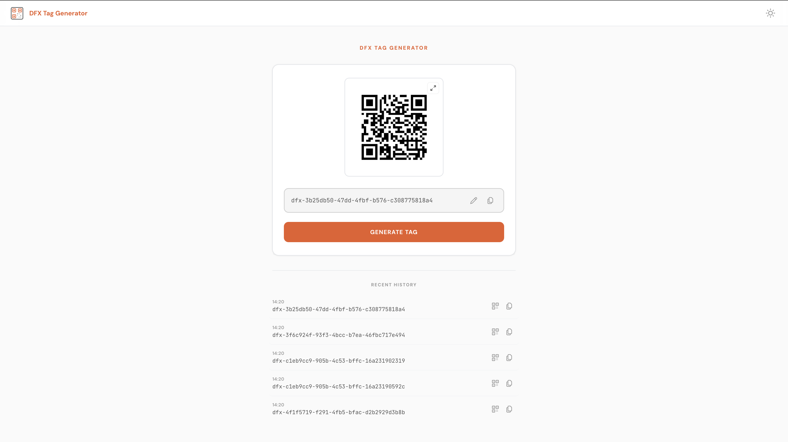
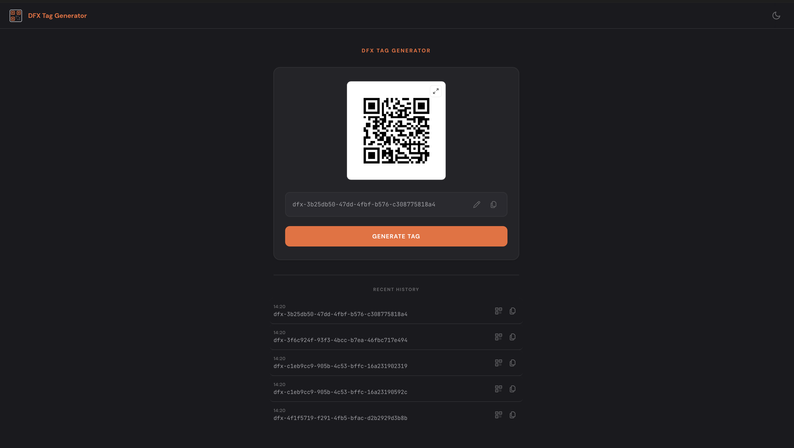

# Asset Tag Generator

A lightweight tool for generating unique asset identifiers and QR codes for OT edge device management. Built in Go, containerised, and deployed on RKE2.




## Features

**Tag Generation** — creates `dfx-` prefixed UUIDs for tracking OT hardware and edge devices. Each tag gets a matching QR code rendered server-side as a Base64 PNG with no external API calls.

**Manual Editing** — tap the pencil icon to edit a tag directly. Validates against the `dfx-xxxxxxxx-xxxx-xxxx-xxxx-xxxxxxxxxxxx` format, regenerates the QR to match, and pushes the edit into history. Invalid input shows an inline error with a one-click regenerate button.

**History QR Recall** — every history entry has a QR button that opens the full-screen QR modal for that tag, so you can scan a previously generated code without regenerating it.

**Copy Behaviour** — exclusive flash logic ensures only one row highlights at a time. Rapid successive copies keep the toast visible for a consistent 2.5s without flickering or cutting short.

**Dark Mode** — auto-detects system `prefers-color-scheme` on first load. Manual toggle (animated sun/moon icon) overrides and persists via localStorage. System changes are still tracked unless manually overridden.

**Responsive** — three breakpoints for desktop, tablet, and mobile. 

## Tech Stack

| Layer | Detail |
|---|---|
| Backend | Go 1.22 — `net/http`, `google/uuid`, `skip2/go-qrcode` |
| Frontend | Vanilla JS, CSS3, DM Sans + JetBrains Mono. Zero frameworks |
| Container | Multi-stage Docker build (golang:alpine → alpine:3.20) |
| Orchestration | RKE2 (Kubernetes v1.34) — Deployment + NodePort Service |
| OS | Rocky Linux |
| Access | Cloudflare Tunnel → `https://getdfx.uk` |

## Architecture

```
Internet → Cloudflare Tunnel → NodePort :30092 → K8s Service → DFX Pod (:9092)
```

The app runs as a single-replica Deployment in the `dfx` namespace with liveness/readiness probes and resource limits. The Cloudflare Tunnel provides TLS termination and secure context (required for the Clipboard API) without opening inbound firewall ports.

## API

| Endpoint | Method | Description |
|---|---|---|
| `/` | GET | Serves the UI with the current tag and QR |
| `/api/generate` | GET | Generates a new tag, returns JSON with UUID, QR base64, and history |
| `/api/qr?text=` | GET | Returns a QR code PNG (base64 JSON) for any given text |
